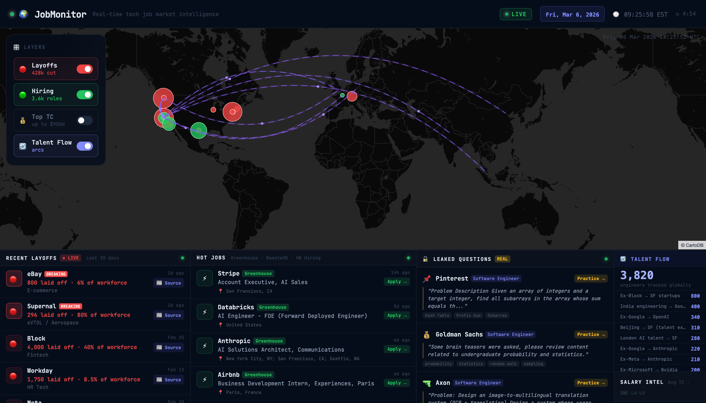

# 🌍 JobMonitor

**Real-time tech job market intelligence dashboard** — built by [InterviewCoder](https://interviewcoder.co)

Track layoffs, hiring surges, talent flow, and salary data across the global tech industry. Live on an interactive dark world map.

> 🔴 Live layoffs · 🔄 Talent flow arcs · 🟢 Hot jobs · 🔓 Leaked interview questions

🌐 **Live at [jobmonitor.co](https://jobmonitor.co)**



---

## ✨ Features

- **🔴 Live Layoff Tracker** — Real-time layoffs sourced from Crunchbase, HN, and Google News. Includes Block (4,000), Amazon (16,000), Meta, Workday, eBay, and more. Hourly scraper keeps it fresh. Every card has a source news link.

- **🔄 Talent Flow** — Animated arc overlays showing where engineers are moving globally: Ex-Google → OpenAI, Ex-Meta → Anthropic, India → Big Tech, Beijing → SF, London → SF, and more. 3,820+ engineers tracked with source links.

- **🟢 Hot Jobs** — Real job listings with direct apply links from Greenhouse (Anthropic, Stripe, Figma, Databricks, Vercel, Airbnb...) + RemoteOK. Tech roles only, sorted by freshness.

- **🔓 Leaked Interview Questions** — Real interview questions from top companies (Pinterest, Goldman Sachs, Airbnb, Axon, LinkedIn...) powered by [InterviewCoder](https://interviewcoder.co). Click any card to practice.

- **💰 Salary Intel** — Average TC by city for SWE L4–L5 with YoY change. SF ($285k) → NYC → Seattle → Remote → London.

- **📊 Market Pulse** — Key stats: total 2026 layoffs, AI job growth (+340%), remote share, median TC, hiring timeline trends.

---

## 🛠 Tech Stack

| Layer | Tech |
|---|---|
| Framework | Next.js 14 (App Router) |
| Map | [Leaflet](https://leafletjs.com) · CartoDB Dark Matter tiles |
| Talent Flow Arcs | Animated SVG overlay on Leaflet |
| Styling | Dark glassmorphism — `#060d1a` background |
| Job Data | Greenhouse API, RemoteOK API, HN "Who's Hiring" |
| Layoff Data | Crunchbase, HN Algolia, Google News RSS + hardcoded backbone |
| Interview Questions | Supabase (InterviewCoder DB) |
| Scraper | Python — hourly cron via `scripts/scrape_layoffs.py` |
| Hosting | Vercel |

---

## 🚀 Getting Started

```bash
# Clone
git clone https://github.com/AbdullA-Ababakre/jobmonitor.git
cd jobmonitor

# Install
npm install

# Configure (optional — for Leaked Interview Questions panel)
cp .env.local.example .env.local
# Add your SUPABASE_URL and SUPABASE_KEY

# Run
npm run dev
```

Open [http://localhost:3000](http://localhost:3000).

The app works without Supabase — the interview questions panel will be empty.

---

## 🗂 Project Structure

```
app/
  api/
    layoffs/      → Layoff data (Crunchbase + HN + hardcoded backbone)
    jobs/         → Hot jobs (Greenhouse + RemoteOK + HN Hiring)
    questions/    → Interview questions from Supabase
  page.tsx        → Main dashboard

components/
  MapWrapper.tsx  → Loads Leaflet from CDN
  MapInner.tsx    → 2D dark map + dot markers + SVG arc overlay
  BottomPanels.tsx → 4-column: Layoffs | Jobs | Questions | Talent+Salary
  LayerPanel.tsx  → Toggle: Layoffs / Hiring / Top TC / Talent Flow
  Header.tsx      → Live clock + date badge

lib/
  data.ts         → Static data: layoffs, hiring, talent arcs, top TC

scripts/
  scrape_layoffs.py → Hourly scraper → public/layoffs-cache.json
```

---

## 🗺 Map Layers

Toggle using the panel on the left side of the map:

| Toggle | Color | What it shows |
|---|---|---|
| 🔴 Layoffs | Red dots | Size = number laid off · click for details + source link |
| 🟢 Hiring | Green dots | Size = open roles · click to view company |
| 💰 Top TC | Yellow dots | Companies paying $400k+ avg TC |
| 🔄 Talent Flow | Purple arcs | Animated engineer migration between cities |

---

## ⏱ Data Freshness

| Data | Refresh Rate | Source |
|---|---|---|
| Layoffs | Hourly (Python cron) | Crunchbase, HN, Google News |
| Jobs | Every 10 min | Greenhouse API, RemoteOK |
| Interview Questions | Every 15 min | InterviewCoder / Supabase |
| Talent Flow | Static (curated) | LinkedIn, Levels.fyi |

---

## 🔓 License

MIT — free to use, fork, and build on.

---

## 💡 Built by InterviewCoder

[**InterviewCoder**](https://interviewcoder.co) provides real-time AI assistance during technical interviews. JobMonitor is our open-source contribution to the community — helping engineers navigate the tech job market with real, live data.

> "We're destroying LeetCode — one interview at a time."

[](https://interviewcoder.co)
[](https://jobmonitor.co)
[](LICENSE)

**Star ⭐ this repo if you find it useful.**
